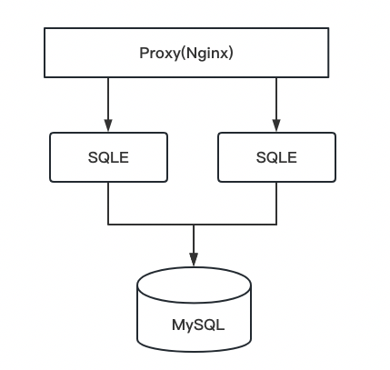

SQLE支持集群模式，支持主节点宕机后，从节点能够提升为主并支持后台任务，执行如工单定时上线，智能扫描任务，工单回收，外部数据源对接，钉钉工单对接等任务，保证任务正常执行。



### 使用场景
当用户需要对SQLE配置高可用场景，确保任一服务节点宕机均不会影响到业务的正常执行时，用户可开启集群模式。

### 配置说明

开启集群模式仅需用户进入SQLE配置文件，修改如下内容:

| 参数 | 说明 | 示例 | 备注 |
|-|-|-|-|
| server:sqle_config:enable_cluster_mode | 是否开启集群模式 | true |  |
| server:sqle_config:server_id | SQLE节点的ID | node_1 | 目前未对节点进行全局唯一校验，需要人工确认集群内不能重复，重复会导致出现多leader等情况|


```jsx title="配置文件示例"
  server:
    sqle_config:
      server_port: 10000
      auto_migrate_table: true
      debug_log: false
      log_path: './logs'
      plugin_path: './plugins'
      enable_cluster_mode: true #
      server_id: node_1 #
    db_config:
      mysql_cnf:
        mysql_host: 
        mysql_port: 
        mysql_user:
        mysql_password: 
        mysql_schema:
```
:::tip
修改配置文件后，需要重启SQLE生效。
:::