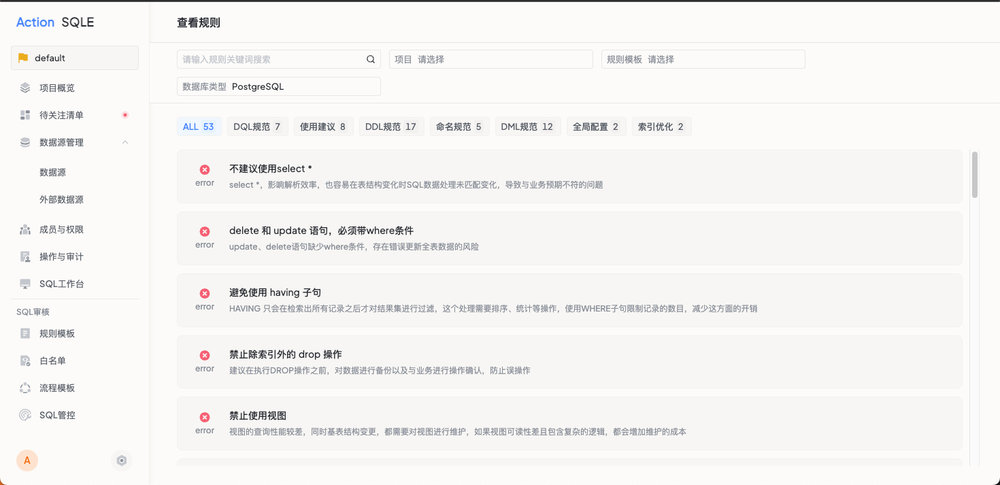

## 配置插件
### 创建插件二进制目录

通常创建在 SQLE 的工作目录

```jsx title="插件目录"
bash-4.2$ ls -l
total 24
drwxr-x--- 2 actiontech-universe actiontech 4096 Oct  8 09:30 bin
drwxrwx--- 1 actiontech-universe actiontech 4096 Oct 12 13:40 etc
drwxr-x--- 1 actiontech-universe actiontech 4096 Oct 12 13:40 logs
drwxr-xr-x 1 actiontech-universe actiontech 4096 Oct  8 09:30 plugins # 创建插件目录
drwxr-x--- 2 actiontech-universe actiontech 4096 Oct  8 09:30 scripts
drwxr-x--- 3 actiontech-universe actiontech 4096 Oct  8 09:30 ui
```
### 修改配置文件sqled.yml
:::tip
根据数据源类型的不同，目前有两种不同的配置文件书写方式。用户应根据实际情况选择相应的配置方式进行填写。
:::
```jsx title="sqled.yml # 针对PostgreSQL、SQL server、TiDB、OceanBase For MySQL类型的数据源"
sqle:
  id: 1
  dms_server_address: http://127.0.0.1:7601
  api:
    addr: 127.0.0.1
    port: 10000
    enable_https: false
    cert_file_path: './etc/cert.pem'
    key_file_path: './etc/key.pem'  
  secret_key:     
  service:
    auto_migrate_table: true   
    debug_log: false
    log_path: './logs'
    log_max_size_mb: 1024
    log_max_backup_number: 2    
    enable_cluster_mode:
    plugin_path: '/plugins'# 此处填写插件目录，也可以填写绝对路径    
    database:
      mysql_host: '10.186.56.59'
      mysql_port: '3306'
      mysql_user: 'root'
      mysql_password: '123456'
      mysql_schema: 'sqle'
```
```jsx title="sqled.yml # 针对Oracle和DB2类型的数据源，须先在SQLE环境中安装JDK，yum install java-1.8.0-openjdk* -y"
sqle:
  id: 1
  dms_server_address: http://127.0.0.1:7601
  api:
    addr: 127.0.0.1
    port: 10000
    enable_https: false
    cert_file_path: './etc/cert.pem'
    key_file_path: './etc/key.pem'  
  secret_key:     
  service:
    auto_migrate_table: true   
    debug_log: false
    log_path: './logs'
    log_max_size_mb: 1024
    log_max_backup_number: 2    
    enable_cluster_mode:
    plugin_path: '/root/workspace/dms/sqle-ee/bin/plugins'# 此处填写插件目录，也可以填写绝对路径
    plugin_config:    
      - plugin_name: 'sqle-db2-plugin-main.jar' # 填写插件文件名称
        cmd: 'java -jar /opt/sqle/plugins/sqle-db2-plugin-main.jar' # 填写插件启动指令及插件绝对路径      
    database:
      mysql_host: '10.186.56.59'
      mysql_port: '3306'
      mysql_user: 'root'
      mysql_password: '123456'
      mysql_schema: 'sqle'
```
:::tip
配置插件时，注意需要同时更新 database_driver_options ，详细配置信息请参考[配置文件说明](/docs/DMS-deploy-manual/config.md)
:::

## 集成插件
将插件的二进制文件放在[配置插件](#配置插件)中创建的 plugins/目录内，其中插件可以由第三方提供或者自行编译，参考：[sqle-pg-plugin](https://github.com/actiontech/sqle-pg-plugin)

ps：在重启 SQLE 前，需要确保 SQLE 的运行用户拥有对二进制文件的执行权限，如果没有，可以通过以下命令来设置：
```
chmod +x /opt/sqle/plugins/sqle-pg-plugin
```

## 重启SQLE Server
```jsx title="rpm方式安装"
systemctl restart sqled
```
```jsx title="docker方式安装"
docker restart sqle-server
```

## 确认插件生效

### 方式一：通过日志
重启后，若成功加载插件，日志中会打印当前加载的审核插件：
```
time="2021-10-12T14:06:42+08:00" level=info msg="starting sqled server"
time="2021-10-12T14:06:42+08:00" level=info msg="plugin inited" plugin_name=PostgreSQL
...
time="2021-10-12T14:06:43+08:00" level=info msg="starting http server on :10000"
```

### 方式二：通过页面
验证是否已加载插件规则：查看 SQLE 规则页面，PostgreSQL 插件支持的审核规则已经加载到 SQLE Server：

验证能否添加插件类型的数据源：添加数据源，显示已经可以添加 PostgreSQL 类型的数据源。


