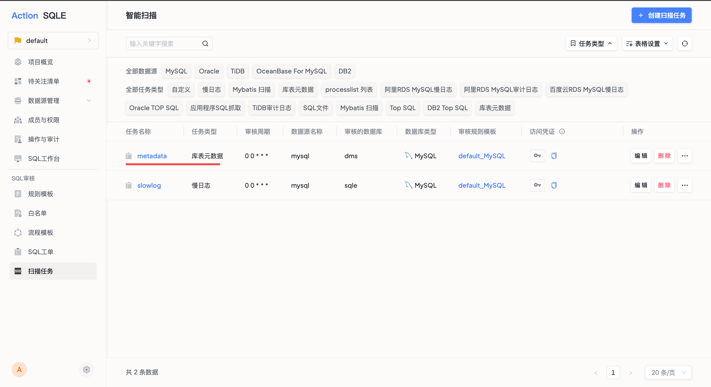
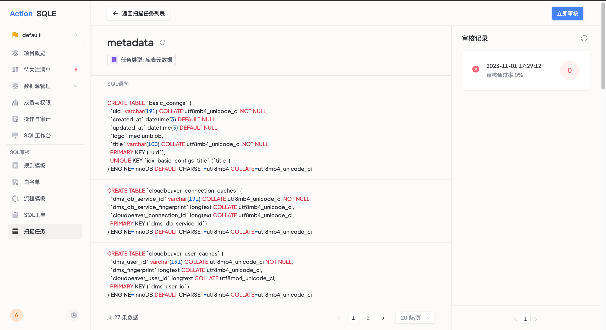

# 库表元数据
本节介绍库表元数据扫描的应用场景、以及如何创建库元数据的扫描任务。

### 支持的数据源类型
* MySQL
* DB2

### 使用场景：

1. 需要检查已上线业务对应数据源的建库建表语句是否符合 统一的SQL质量规范。
2. 需要定期检查上线业务的库表变更是否符合 统一的SQL质量规范。

### 前置条件
已添加对应数据源。

### 操作步骤
新建智能扫描任务

* 任务名称：输入审核任务名称，必须以字母开头；
* 数据源名称：指定扫描任务实施的数据源；
* 数据库：填写需要审核的目标库，若不填则仅进行静态分析不会连库；
* 数据库类型：根据选取的数据源呈现；
* 任务类型：选择需要执行的审核任务类型，选择库表元数据；
* 采集周期（分钟）：将采集设定时间内产生的SQL；
* 是否采集视图信息：默认不采集视图信息，若开启，则将一并扫描数据源上的视图SQL；
* 审核规则模板：如果未指定此项会优先使用数据源绑定的模板；
* 任务审核周期：配置的是SQLE对审核任务进行自动审核的执行时间；

### 执行结果
可在扫描任务列表页面查看新建的库表元数据扫描任务。

点击扫描任务，可查看该扫描任务采集的SQL，及生成的扫描任务报告。

### 后续步骤
* 查看审核记录，查看不同时间点的审核结果，包括审核的SQL语句、审核结果。
* 分析语句，用户可对SQL语句进行分析操作，获取优化建议。
