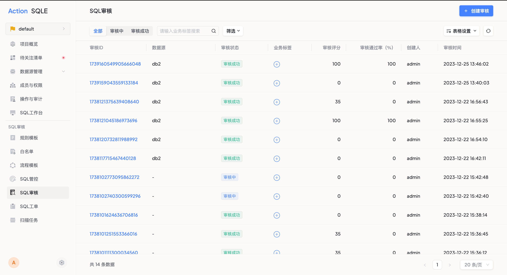

# SQL快捷审核

本文介绍平台的SQL审核功能，该功能可以帮助用户快速审核SQL并了解优化建议。

## 使用场景
当用户需要快速审核SQL并了解可优化点时，可以使用平台的SQL审核功能，快速获取审核结果。

## 前置条件

用户需要进入项目页面才能使用SQL审核功能。

## 操作步骤

用户点击左侧菜单栏的SQL审核标签，进入SQL审核列表页面，点击'新建'按钮。

### 输入审核标签

* 用户可以使用标签来区分SQL的性质、来源等特性；
* 平台默认提供两种标签，用户可根据需要新建标签；

### 选择审核模式

平台默认提供两种审核模式
* 静态审核：脱库审核，无需选择数据源和数据库，但需要选择SQL对应的数据源类型。
* 动态审核：连库审核，需要指定数据源、数据库；

### 输入待审核SQL

平台当前提供5种审核方式，以满足不同的SQL场景。

* 在线输入：直接在界面上输入SQL。
* 上传XML文件：上传包含SQL的XML文件。
* 上传SQL文件：上传SQL文件进行审核。
* 上传ZIP文件：上传包含多个SQL文件的ZIP文件进行审核。
* 配置GIT仓库：从GIT仓库中获取SQL文件进行审核。

### 点击立即审核，获得审核结果

完成SQL输入后，用户点击`立即审核`按钮，获得平台给出的审核建议

## 执行结果
审核完成后，用户可以查看审核结果并在SQL审核列表中查看生成的审核记录。

## 后续操作
添加了标签的SQL审核记录将进入SQL管控列表页面，用户可以在[管控列表](./sqlmanage.md)页面统一管理SQL。
