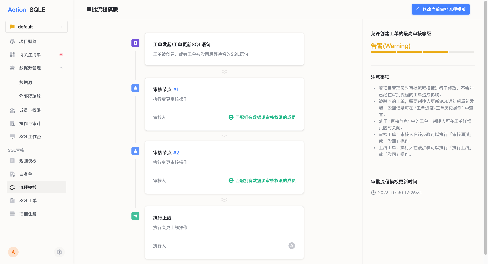

# 流程模版
本文介绍项目中的审核流程模板管理。
SQLe平台应用审核流程模板来规范项目内工单审核、上线的流程，项目管理员可配置审核涉及的节点、操作用户，及上线节点的操作用户。
一个项目有且仅有一个审核流程模板。
:::tip
每个项目对应使用一个流程模版，项目创建后会初始化一个默认模版，用户可根据实际情况调整
:::

:::tip
工单审核步骤若选择`匹配所有拥有审核权限的用户`时对应的数据源没有对应的人员则默认指定管理员进行审批操作
:::
:::caution
修改流程模版仅对之后的工单有效，之前的工单流程步骤不变
:::

### 使用场景
一个业务团队中，开发需要在指定数据源上执行SQL，上线的SQL需要符合DBA约定了的安全以及性能规范。因此，SQLe为工单场景提供了不同人员之间的协作工作流，即审核流程。

### 前置条件
项目管理员进入指定的项目
项目管理员已添加项目成员/成员组

### 配置审核流程
项目管理员点击左侧导航栏【流程模板】菜单， 点击【修改当前审批流程模板】按钮

#### 步骤一：设定模板的基本信息
设置允许创建工单的最高审核等级：当前提供四种审核等级，包括：普通、提示、告警、错误。若设置“运行查询的最高审核等级”为warn，则审核结果小于等于warn的sql都可以执行
#### 步骤二：设置流程节点 
审核流程自工单发起开始，通过设置的审核步骤后，最后以执行上线结束

第一步 工单发起：项目成员创建工单

第二步 工单审核：审核人在该步骤可以执行审核通过或驳回操作。
* 选择审核人类型，当前提供两种方式：指定审核人或匹配拥有数据源审核权限的成员
    * 若选择指定审核人：则需要项目管理员指定项目成员
        * 最少需要添加一个指定人，最多只能添加三个指定人
        * 指定的审核人可以没有工单审核权限
    * 若选择匹配拥有数据源审核权限的成员：则将自动匹配工单对应数据源上拥有审核权限的成员
        * 创建工单时所有拥有对应数据库工单审核权限的用户(组)都会被指定为此步审核者, 如果创建工单时没有任何用户拥有此数据源工单审核权限, 则工单审核者将会被指定为项目管理员
* 添加步骤描述：用以补充说明步骤信息
* 添加审核步骤：审核流程模板最多可设置4个审核节点，也可不设置审核步骤

第三步 工单上线：执行人在该步骤可以执行上线或驳回操作。
* 选择审核人类型，当前提供两种方式：指定上线人或匹配拥有数据源上线权限的成员
    * 若选择指定审核人，则需要项目管理员指定项目成员
        * 最少需要添加一个指定人，最多只能添加三个指定人
        * 指定的上线人可以没有工单审核权限
    * 若选择匹配拥有数据源上线权限的成员，则将自动匹配工单对应数据源上拥有上线权限的成员
        * 创建工单时所有拥有对应数据库工单上线权限的用户(组)都会被指定为此步审核者, 如果创建工单时没有任何用户拥有此数据源工单上线权限, 则工单审核者将会被指定为项目管理员
* 添加步骤描述

第四步 提交审核流程模板
* 提交审核流程后，流程修改之前创建的工单仍以提交工单时的审核流程执行，流程修改后的创建的工单将以当前的审核流程执行流转。

### 执行结果
提交审核流程模板后，可查看当前设置的审批流程模板涉及的步骤节点，及各步骤的审核人。

### 后续步骤
创建工单：创建审核流程模板后，成员可进入项目中创建工单，请参见：[创建工单](../project/workflow/create-workflow.md)
