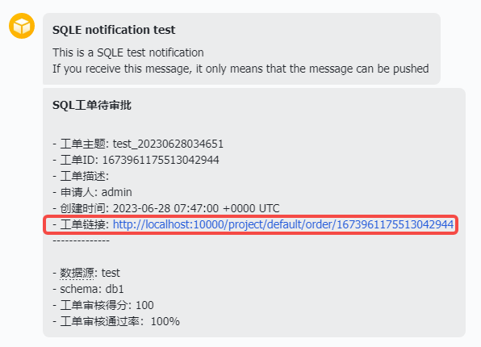

SQLE支持管理员对平台基础配置进行统一管理，目前支持修改的配置项包括：
* 已完成的工单自动过期时间；
* 操作记录过期时间；
* URL地址前缀；

### 已完成的工单自动过期时间

#### 使用场景
SQLE会定时回收已完成的工单，目前该过期时间默认为30天。如果用户需要自定义过期时间，可在全局配置中修改。

#### 填写范例
* 进入全局配置页面，点击`修改`；
* 点击`已完成的工单过期时间`输入框；
* 输入预期的过期时间，例如：360小时；
* 点击`提交`，保存配置；
* 此时查看项目工单列表，已完成15天以上的工单将被删除；

### 操作记录过期时间

#### 使用场景
SQLE会定时回收已产生的操作记录，目前该过期时间默认为90天。如果用户需要自定义过期时间，可在全局配置中修改。

#### 填写范例
* 进入全局配置页面，点击`修改`；
* 点击`操作记录过期时间`输入框；
* 输入预期的过期时间，例如：2小时；
* 点击`提交`，保存配置；
* 此时查看平台操作记录，仅显示2个小时内产生的操作行为；

### URL地址前缀

#### 使用场景
配置消息推送或流程对接后，用户可以从外部应用程序中直接查看待操作提示。此时，如果用户需要跳转到SQLE，进一步查看工单详细信息，则可以在全局配置中更改URL地址前缀，以满足访问需求。

#### 填写范例
* 进入全局配置页面，点击`修改`；
* 点击`URL地址前缀`输入框；
* 输入URL前缀，格式为http://ip:port，例如：http://localhost:10000 ；
* 点击`提交`，保存配置；
* 创建一条工单，待审批人在第三方应用中可查看工单链接，点击链接可快速跳转至SQLE平台；

